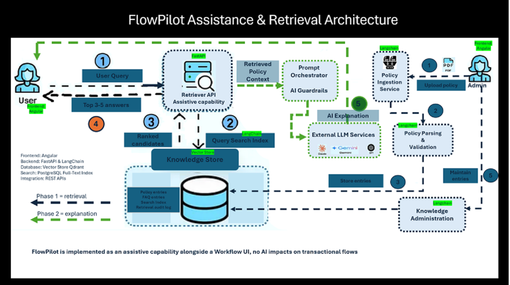

# FlowPilot — Architecture Documentation

> AI-assisted enterprise vendor onboarding — portfolio project demonstrating senior AI architect capabilities.

---

## Assistance & Retrieval Architecture



FlowPilot is implemented as an **assistive capability alongside a Workflow UI**. No AI impacts transactional flows directly — the AI layer retrieves, explains, and recommends; humans approve and act.

### Two-phase design

| Phase | What happens |
|---|---|
| **Phase 1 — Retrieval** | User query → Retriever API → hybrid search (vector + full-text) → ranked candidates → top 3–5 answers returned |
| **Phase 2 — Explanation** | Retrieved policy context → Prompt Orchestrator → AI Guardrails → External LLM → grounded explanation with citations |

### Admin ingestion flow

Policy PDF uploaded by Admin → Policy Ingestion Service → Policy Parsing & Validation (LangChain) → Knowledge Administration → stored in Knowledge Store (Qdrant + PostgreSQL full-text index).

---

## Tech stack

| Layer | Technology |
|---|---|
| Frontend | Angular |
| Backend | FastAPI · LangChain · LangGraph |
| Vector store | Qdrant |
| Full-text index | PostgreSQL Full-Text Index |
| LLM | OpenAI GPT-4o (primary) · Gemini (reference) |
| Integration | REST APIs |
| Auth | JWT-based RBAC (shared middleware) |
| State | SQLite (workflow state + audit log) |

---

## Repositories

| Repo | Purpose |
|---|---|
| [`flowpilot-docs`](.) | Architecture documentation — all diagrams, models, ADRs |
| [`flowpilot-rag-service`](https://github.com/nitindra-soekhai/flowpilot-rag-service) | Policy ingestion, hybrid retrieval, grounding, guardrails |
| [`flowpilot-vendor-onboarding`](https://github.com/nitindra-soekhai/flowpilot-vendor-onboarding) | Onboarding workflow, LangGraph agent, HITL approval gateway |

---

## Architecture documents

| Artifact | File |
|---|---|
| C4 Level 1 — System context | [`architecture/c4-level1-context.md`](architecture/c4-level1-context.md) |
| C4 Level 2 — Container diagram | [`architecture/c4-level2-containers.md`](architecture/c4-level2-containers.md) |
| C4 Level 3 — RAG service components | [`architecture/c4-level3-rag-service.md`](architecture/c4-level3-rag-service.md) |
| C4 Level 3 — Vendor onboarding components | [`architecture/c4-level3-vendor-onboarding.md`](architecture/c4-level3-vendor-onboarding.md) |
| Information model | [`architecture/information-model.md`](architecture/information-model.md) |
| Data model — SQLite + Qdrant | [`architecture/data-model.md`](architecture/data-model.md) |
| RBAC role matrix + enforcement | [`architecture/rbac.md`](architecture/rbac.md) |
| Happy path sequence diagram | [`architecture/happy-path-sequence.md`](architecture/happy-path-sequence.md) |
| Deployment — Docker + Azure reference | [`architecture/deployment.md`](architecture/deployment.md) |
| ADR-010 — RBAC decision | [`architecture/adr/ADR-010-rbac.md`](architecture/adr/ADR-010-rbac.md) |

---

## Design principles

- **Governed AI** — every AI action is auditable, permission-aware, and explainable
- **Human-in-the-loop** — approvals are always human; the agent cannot self-approve
- **Agent permission boundary** — an agent cannot exceed the permissions of the user who triggered it (ADR-010)
- **Mock-first** — full architecture runs without an OpenAI key; mock mode enables local development and testing
- **Retrieval-grounded** — all AI recommendations are cited against specific policy clauses; no hallucinated guidance

---

## Local setup

```bash
# Prerequisites: Docker running, Qdrant image pulled, Python 3.11+

# Clone all repos
git clone https://github.com/nitindra-soekhai/flowpilot-rag-service
git clone https://github.com/nitindra-soekhai/flowpilot-vendor-onboarding

# Start Qdrant
docker run -p 6333:6333 qdrant/qdrant

# RAG service
cd flowpilot-rag-service
pip install -r requirements.txt
uvicorn app.main:app --port 8000

# Vendor onboarding service
cd flowpilot-vendor-onboarding
pip install -r requirements.txt
uvicorn app.main:app --port 8001
```

---

## Build status

| Service | Status |
|---|---|
| flowpilot-rag-service | 🔜 Day 1 |
| flowpilot-vendor-onboarding | 🔜 Day 2 |
| Architecture docs | ✅ Day 0 complete |
