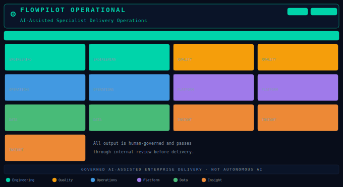
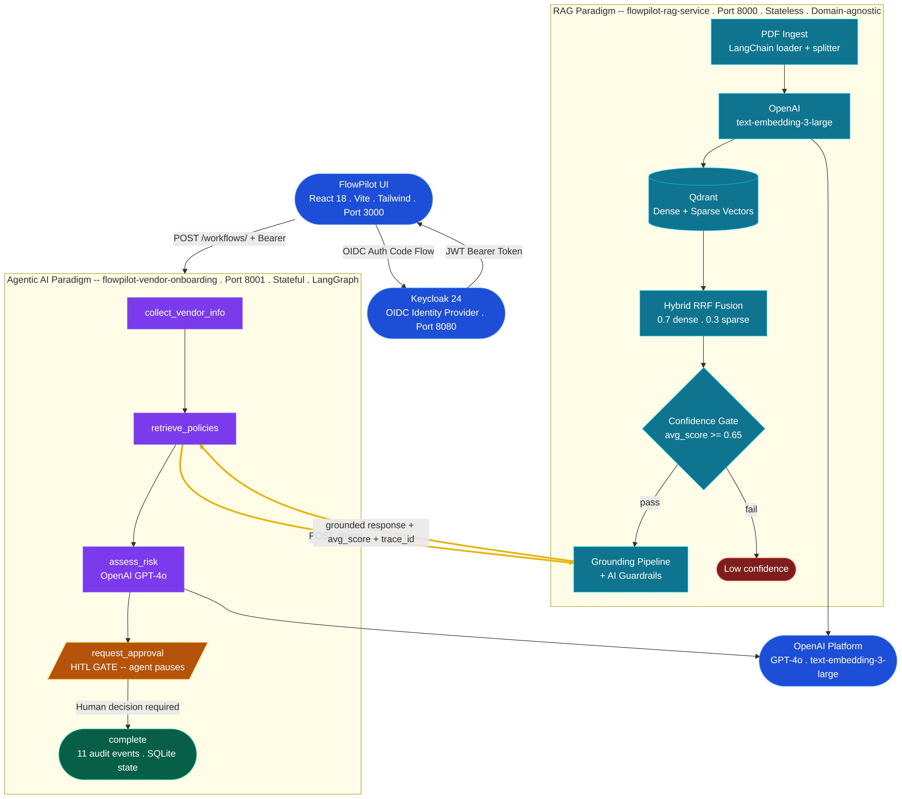
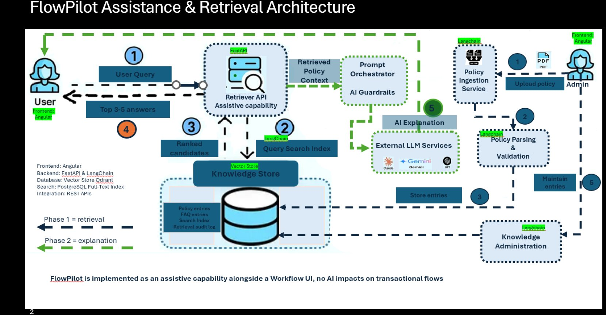
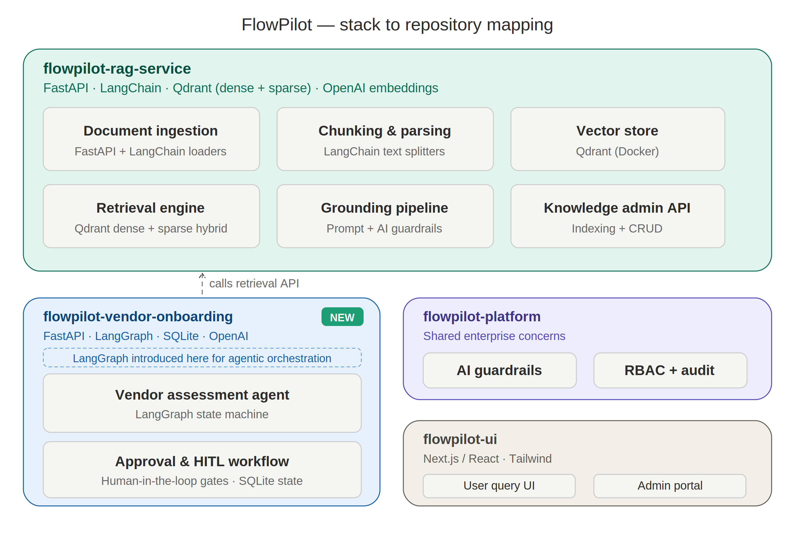
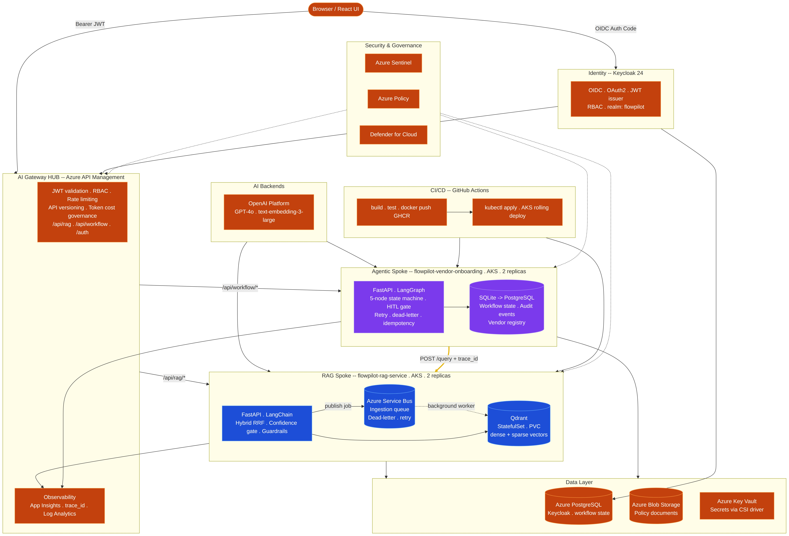
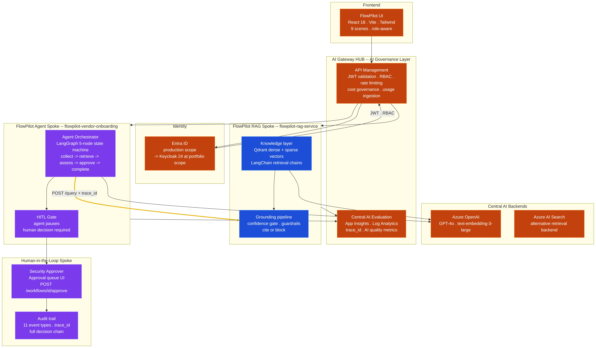
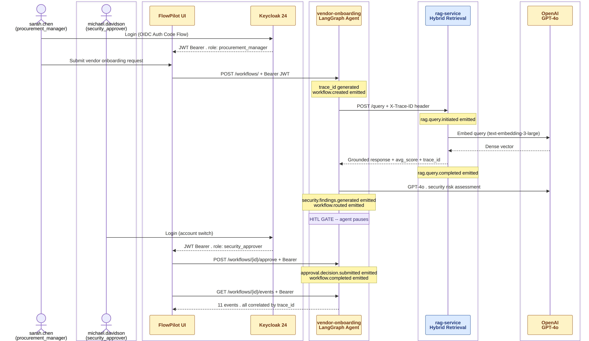

https://github.com/user-attachments/assets/e88281c4-907b-459f-856a-9b38a171d1cb

# FlowPilot — Enterprise AI Orchestration Platform

**Built by Nitindra Soekhai · NSCS B.V.**

> An enterprise AI orchestration platform demonstrating senior AI architect capabilities — designed as a reusable platform, demonstrated through a vendor onboarding use case. RAG architecture, agentic orchestration, human-in-the-loop governance, operational resilience, and full observability.

**The vendor onboarding workflow is the demonstration domain. FlowPilot is the platform.**

| Repository | Role | Build |
|---|---|---|
| `flowpilot-rag-service` | RAG — hybrid retrieval, grounding pipeline | [](https://github.com/nitindra-soekhai/flowpilot-rag-service/actions) |
| `flowpilot-vendor-onboarding` | Agentic AI — LangGraph, HITL, SQLite state | [](https://github.com/nitindra-soekhai/flowpilot-vendor-onboarding/actions) |
| `flowpilot-docs` | Architecture — 20 ADRs, diagrams, governance | [](https://github.com/nitindra-soekhai/flowpilot-docs) |

---

## What FlowPilot Demonstrates

| Capability | What it delivers |
|---|---|
| **Policy Guidance** | Grounded, cited answers from the enterprise knowledge base via hybrid RAG retrieval |
| **Workflow Orchestration** | Autonomous 5-stage LangGraph agent: collect → retrieve → assess → approve → complete |
| **Approval Coordination** | Multi-department approval routing with escalation, timeout handling, and preserved human authority |
| **Audit & Traceability** | `trace_id` correlation across services; 11 structured event types; full decision chain reconstructable |
| **Governed AI Interaction** | AI may recommend, never approve. RBAC bounds agent scope. Uncited guidance is blocked. |

---

## Live Demo — Full User Journey

https://github.com/user-attachments/assets/e88281c4-907b-459f-856a-9b38a171d1cb

> Full walkthrough: OPERATIONAL homepage → vendor intake → RAG policy retrieval →
> AI security analysis → human approval gate → audit trail

---

## AI Specialist Collaboration Model

FlowPilot explores governed AI-assisted collaboration patterns for enterprise AI delivery, operational workflows, governance orchestration, and platform engineering.

The model is based on specialized AI delivery responsibilities operating under human governance authority. Claude acts as orchestration coordinator — managing context routing, task segmentation, and specialist collaboration flows across engineering, quality, operations, data, and architecture domains.

Rather than relying on a single long-running generalized AI session, FlowPilot intentionally separates responsibilities into specialized collaboration contexts to improve consistency, delivery quality, governance control, and architectural precision during complex implementation cycles.

All output remains human-governed and passes through internal coordination and review gates before implementation decisions are finalized.



### Specialist Collaboration Responsibilities

| Domain | Specialist Context | Responsibility |
|---|---|---|
| Engineering | Enterprise Retrieval | Grounding, retrieval optimization, RAG architecture |
| Engineering | Vendor Onboarding | Workflow orchestration, approvals, onboarding flows |
| Quality | Security | RBAC, OIDC, OWASP, GDPR, ISO 27001 |
| Quality | QA | pytest, Playwright, validation, coverage gates |
| Operations | Infrastructure | Azure architecture, Terraform readiness |
| Operations | DevOps | CI/CD, Docker pipelines, GitHub Actions |
| Platform | Frontend Experience | React UI, runtime scenes, UX consistency |
| Platform | Middleware | Messaging, integration, orchestration patterns |
| Data | Database | Schema design, migrations, DBA concerns |
| Data | MLOps | Retrieval metrics, token costs, LLM operations |
| Insight | Analyst | Functional scope, operational requirements |
| Insight | Architecture Knowledge | ADRs, C4 models, architecture documentation |
| Insight | Analytics | Dashboards, telemetry, operational statistics |

This is governed AI-assisted enterprise delivery — not autonomous AI.

---

## Why This Architecture?

This section explains the decisions that distinguish architectural thinking from engineering execution.

### Why deterministic retrieval first?

Policy guidance is a retrieval problem, not a reasoning problem. Employees need accurate, cited answers from authoritative policy documents — not LLM-generated approximations. Deterministic hybrid retrieval (dense + sparse vectors, RRF fusion) with a confidence gate ensures answers are grounded, traceable, and consistent. Where determinism is possible, it is preferred over autonomy.

### Why agentic AI only where orchestration is genuinely required?

Vendor onboarding requires sequential, stateful decision-making across multiple steps — each dependent on the output of the previous. A static retrieval pipeline cannot handle conditional branching, tool sequencing, human interruption, or compensating actions. LangGraph is introduced only at this boundary. Agentic execution is not the default — it is the deliberate choice for problems that require it.

### Why HITL exists as an architectural concern, not a feature?

The agent produces recommendations grounded in retrieved policy. It cannot assess business context, relationship factors, or exception criteria that a human approver holds. HITL is not a safety net added after the fact — it is the explicit boundary between AI autonomy and human authority, enforced at the platform level. The agent is designed to pause. That is not a limitation. That is the governance model.

### Why Qdrant over pgvector?

Vendor onboarding policies contain regulatory identifiers (ISO 27001 control numbers, GDPR Article references, SOC 2 criteria) that semantic search deprioritises. Dense-only search ranked semantically fluent chunks above chunks containing exact clause references. Qdrant supports both dense and sparse vectors natively in a single collection — enabling hybrid retrieval without a join across two systems. See ADR-001.

### Why LangGraph over a custom orchestration engine?

LangGraph provides state machine semantics, checkpoint persistence, and conditional edge routing without requiring a custom workflow engine. The 5-node state machine maps directly to the vendor assessment lifecycle. State is persisted after each node — enabling workflow recovery on restart without re-execution. LangGraph is restricted to the domain layer (ADR-003) to prevent framework lock-in at the platform level.

### Why SQLite for workflow state?

At portfolio scope, SQLite provides zero-config persistent state with ANSI SQL portability. The schema is designed for migration: replacing SQLite with PostgreSQL requires a config change, not an application rewrite. The accepted tradeoff is documented explicitly in ADR-005. Production migration path: change the connection string, run the schema migration, no application code changes.

### Why RBAC enforced at the platform level?

Role-based access control applied per-domain produces duplicated, inconsistent enforcement. FlowPilot enforces RBAC at the platform layer — every agent tool call is validated against the requesting user's permission set before execution. An agent cannot exceed the permissions of the user who triggered it, regardless of what the agent decides to do.

---

## Enterprise Concerns

FlowPilot is designed against the concerns that enterprise architecture review boards, security teams, and AI governance committees evaluate.

| Concern | How FlowPilot addresses it |
|---|---|
| **Multi-tenant isolation** | Planned — workflow state and audit events are user-scoped; tenant isolation is the documented production upgrade path |
| **RBAC enforcement** | Platform-level via Keycloak JWT validation; role extraction filters system roles; agent tool calls validated against user permissions |
| **Auditability & traceability** | `trace_id` generated at API boundary, propagated across all service calls; 11 structured audit event types; full decision chain reconstructable |
| **Prompt governance** | Grounding pipeline enforces citation; guardrails layer blocks uncited responses; prompt template versioning documented |
| **Hallucination reduction** | Confidence gate (avg_score ≥ 0.65) blocks LLM call on low-quality retrieval; agent suspends and requests human clarification |
| **Deterministic retrieval** | Hybrid RRF fusion; confidence threshold; top-k chunk scoring visible in audit trail |
| **Human-in-the-loop escalation** | HITL gate at `request_approval` node; agent pauses; approval timeout triggers compensating action and escalation |
| **Retry & degraded mode** | Exponential backoff (500ms, ×2, max 3 attempts); RAG unavailable → structured questionnaire fallback; `degraded=true` in all log lines |
| **Idempotent workflows** | Unique constraint on `request_id` prevents duplicate workflow creation under network retry conditions |
| **Policy-grounded AI decisions** | Retrieved policy chunks injected into prompt with citation instruction; response blocked if no source cited |

---

## Why Agents Are Not Always the Answer

FlowPilot intentionally separates deterministic and agentic execution. This separation is the core architectural decision.

**Deterministic retrieval is used when:**
- The answer exists in a policy document
- Consistency and reproducibility are required
- Governance demands a traceable, cited source
- The operation is stateless and query-response in nature

**Agentic execution is used only when:**
- Multiple dependent decisions exist across sequential steps
- Stateful orchestration is required between operations
- Tool sequencing is dynamic and context-dependent
- Human approval may interrupt execution mid-workflow
- Compensating actions must be triggered on failure

**The result:** RAG handles policy guidance. LangGraph handles workflow orchestration. Neither crosses the other's boundary (ADR-007). A future domain — contract management, IT provisioning, compliance assessment — can consume the RAG service without touching the agentic layer.

Agentic AI applied where determinism suffices produces unpredictable, ungovernable, and unauditable systems. FlowPilot is deliberately structured to prevent this.

---

## Architecture Decision Records

| ADR | Layer | Decision |
|---|---|---|
| [ADR-001](adr/ADR-001-qdrant-over-pgvector.md) | 🔵 RAG | Qdrant over PostgreSQL pgvector |
| [ADR-002](adr/ADR-002-hybrid-retrieval.md) | 🔵 RAG | Hybrid retrieval over dense-only |
| [ADR-003](adr/ADR-003-langgraph-domain-only.md) | 🟣 Agentic AI | LangGraph restricted to domain layer |
| [ADR-004](adr/ADR-004-hitl-platform-concern.md) | 🟣 Agentic AI | HITL as platform-level concern |
| [ADR-005](adr/ADR-005-sqlite-workflow-state.md) | 🟣 Agentic AI | SQLite accepted for workflow state |
| [ADR-006](adr/ADR-006-fastapi-over-spring-boot.md) | 🟠 Shared | FastAPI over Spring Boot |
| [ADR-007](adr/ADR-007-retrieval-separated-from-orchestration.md) | 🟡 Boundary | Retrieval service separated from orchestration |
| [ADR-008](adr/ADR-008-vendor-onboarding-domain.md) | 🟠 Shared | Vendor onboarding as demonstration domain |
| [ADR-009](adr/ADR-009-mock-mode.md) | 🟠 Shared | Mock mode for zero-friction demonstration |
| [ADR-010](adr/ADR-010-structlog-json-logging.md) | 🟠 Shared | Structured JSON logging over traditional logging |
| [ADR-011](adr/ADR-011-reranking-layer.md) | 🔵 RAG | No dedicated reranking layer at portfolio scope |
| [ADR-012](adr/ADR-012-keycloak-identity-provider.md) | 🟠 Shared | Keycloak as identity provider |
| [ADR-013](adr/ADR-013-event-feed-polling-over-sse.md) | 🟠 Shared | Event feed via UI polling over SSE |
| [ADR-014](adr/ADR-014-azure-service-bus-ingestion-queue.md) | 🔵 RAG | Azure Service Bus as async ingestion queue — production-ready by design |
| [ADR-015](adr/ADR-015-langgraph-state-machine-over-multi-agent.md) | 🟣 Agentic AI | LangGraph state machine over autonomous multi-agent orchestration |
| [ADR-016](adr/ADR-016-secrets-management-azure-key-vault.md) | 🟠 Shared | Azure Key Vault via Managed Identity — secrets management |
| [ADR-017](adr/ADR-017-polyrepo-strategy.md) | 🟠 Shared | Polyrepo strategy over monorepo — flowpilot-docs as central skills source of truth |
| [ADR-018](adr/ADR-018-demo-to-production-adapter-pattern.md) | 🟠 Shared | Demo-to-production adapter pattern for infrastructure components |
| [ADR-019](adr/ADR-019-opswat-document-scanning.md) | 🟠 Shared | OPSWAT document scanning |
| [ADR-020](adr/ADR-020-internal-notification-system.md) | 🟠 Shared | Internal notification system |

---

## Architecture

### Two AI Paradigms — Explicitly Separated



### Architecture Diagrams





### Diagram Index — Source Files

| Diagram | Level | Source |
|---|---|---|
| System Context | C4 Level 1 | [c4-context.md](architecture/c4-context.md) |
| Container Diagram | C4 Level 2 | [c4-container.md](architecture/c4-container.md) |
| Component — vendor-onboarding | C4 Level 3 | [c4-component.md](architecture/c4-component.md) |
| Component — rag-service | C4 Level 3 | [c4-level3-rag-service.md](architecture/c4-level3-rag-service.md) |
| Component — vendor-onboarding (flowchart) | C4 Level 3 | [c4-level3-vendor-onboarding.md](architecture/c4-level3-vendor-onboarding.md) |
| Deployment — Docker + Azure | Infrastructure | [deployment.md](architecture/deployment.md) |
| Happy Path | Sequence | [sequence-happy-path.md](architecture/sequence-happy-path.md) |
| Failure Paths | Sequence | [sequence-failure-paths.md](architecture/sequence-failure-paths.md) |
| Approval Timeout | Sequence | [sequence-approval-timeout.md](architecture/sequence-approval-timeout.md) |
| Data Model | Physical schema | [data-model.md](architecture/data-model.md) |
| Information Model | Domain entities | [information-model.md](architecture/information-model.md) |
| RBAC | Role matrix | [rbac.md](architecture/rbac.md) |
| Domain Boundaries | Boundary map | [domain-boundaries.md](architecture/domain-boundaries.md) |

---

## Deployment Architecture

> **Current scope:** Local Docker Compose. The production architecture below documents the target deployment — demonstrating infrastructure thinking beyond the portfolio implementation.



| Decision | Rationale |
|---|---|
| APIM as gateway | Centralised rate limiting, JWT validation, API versioning, and token cost governance |
| AKS over ACI | Horizontal scaling, health probes, rolling deployments, namespace-level isolation |
| Qdrant as StatefulSet | Requires persistent volumes and stable network identity |
| PostgreSQL for production | SQLite replaced at production scope; schema migration is config-only (ADR-005) |
| Key Vault for secrets | Injected via CSI driver — never in environment variables in production |

---

## FlowPilot in the Azure AI Hub/Spoke Ecosystem

FlowPilot is designed to operate as a **spoke** in the Microsoft Azure AI Foundry Hub/Spoke reference architecture. Each FlowPilot component maps directly onto a recognised pattern in that ecosystem.



## Mapping to Azure AI Reference Architecture

| Azure AI Hub/Spoke pattern | FlowPilot component | Notes |
|---|---|---|
| Central AI Backends → Azure OpenAI | OpenAI GPT-4o + text-embedding-3-large | Shared by both RAG and Agentic spokes |
| AI Gateway HUB → APIM | Azure API Management | JWT validation, rate limiting, cost governance |
| AI Governance Layer → RBAC | Keycloak 24 → Entra ID in production | Keycloak is portfolio scope; OIDC contract is identical |
| AI-Foundry-Agents SPOKE | flowpilot-rag-service | Knowledge retrieval, confidence gating, guardrails |
| Multi-Agent System SPOKE | flowpilot-vendor-onboarding | LangGraph orchestrator; RAG service is the knowledge tool |
| Logic-App-Agent SPOKE → HITL | HITL approval gate | Agent pauses at `request_approval`; human approver resumes via UI |
| Central AI Evaluation | App Insights + Log Analytics | trace_id correlation; 11 audit event types; retrieval quality metrics |
| Entra ID | Keycloak 24 | Production upgrade: replace JWKS URL and issuer — no code changes |

---

## Governance Boundaries

| Boundary | Enforcement |
|---|---|
| **AI may recommend, never approve** | HITL gate in LangGraph — agent pauses and cannot self-approve |
| **Explanations must cite sources** | Guardrails layer blocks any response without retrieved context reference |
| **Low confidence blocks continuation** | Confidence threshold gate suspends the agent below 0.65 |
| **RBAC bounds agent scope** | Agent cannot exceed permissions of the triggering user |
| **All decisions are logged** | Every LLM call, retrieval, decision, and approval written to audit log |

---

## Traceability — Every AI Decision Is Reconstructable



---

## Retrieval Scoring & Confidence

| Metric | What it means | Target |
|---|---|---|
| `avg_score` | Average similarity score of retrieved chunks (0–1) | > 0.65 |
| `confidence_met` | Whether avg_score exceeded the confidence threshold | `true` |
| `results_count` | Number of chunks returned (top-k) | 5 |
| `latency_ms` | Total retrieval + LLM grounding time | < 3000ms |
| `strategy` | Retrieval mode used | `hybrid` |

---

## Operational Resilience

| Mechanism | Implementation |
|---|---|
| **Retry** | Exponential backoff with jitter — 500ms initial, ×2 multiplier, max 3 attempts |
| **Dead-letter** | Failed steps written to SQLite dead-letter table with full execution context |
| **Compensating actions** | Approval timeout triggers stakeholder notification and state revert |
| **Degraded mode** | RAG unavailable → structured questionnaire fallback, flagged in log and UI |
| **Idempotency** | Unique constraint on request ID prevents duplicate workflow creation |
| **Workflow recovery** | LangGraph state persisted after each node — resumes from last checkpoint on restart |

---

## Production Readiness

| Capability | Status |
|---|---|
| RAG retrieval (hybrid RRF, confidence gate) | ✅ Implemented |
| Agentic state machine (LangGraph, 5 nodes) | ✅ Implemented |
| HITL approval gate | ✅ Implemented |
| RBAC enforcement (Keycloak OIDC, JWT) | ✅ Implemented |
| Audit trail (11 event types, trace_id) | ✅ Implemented |
| Operational resilience (retry, dead-letter, degraded mode) | ✅ Implemented |
| Idempotency guarantees | ✅ Implemented |
| Workflow checkpoint recovery | ✅ Implemented |
| Structured JSON logging (structlog) | ✅ Implemented |
| Policy document management UI | ✅ Implemented |
| Evaluation pipeline (retrieval quality, LLM output) | 📊 Planned |
| Multi-tenancy isolation | 📊 Planned |
| Operational SLIs/SLOs | 📊 Planned |
| Cost governance (token budget, per-workflow tracking) | 📊 Planned |
| Production infrastructure (AKS, APIM, ingress) | 📊 Planned |

---

## Known Limitations & Tradeoffs

> Stated openly — senior engineers trust people who understand their own constraints.

- **SQLite** — accepted at portfolio scope. PostgreSQL is the documented production path; migration is config-only, no application code changes (ADR-005)
- **No reranking layer** — hybrid RRF sufficient at this corpus size. Cross-encoder reranking is the documented upgrade path at scale (ADR-011)
- **No load testing** — not fabricated. Concurrency and throughput testing planned before productionisation
- **AKS deployment** — documented production target, not yet automated. Terraform + Kubernetes manifests are the next infrastructure milestone
- **Evaluation framework** — retrieval scoring (`avg_score`, `confidence_met`, `latency_ms`) visible in the audit trail. Formal LLM output evaluation pipeline is planned
- **Intentionally optimises clarity over scale** — this is a portfolio demonstrating architectural thinking. Production hardening is the documented next phase, not a gap in understanding

---

## Engineering Proof

| Signal | Evidence |
|---|---|
| **Tests** | `pytest` — RAG pipeline, LangGraph nodes, HITL logic, RBAC enforcement, retry/dead-letter |
| **15 issues resolved** | Docker networking, OIDC chain, role extraction, UI/API mismatches — all documented with root cause and fix |
| **Observability is live** | 11 structured audit events visible in the running UI — not mocked, called from real API |
| **Auth is real** | Keycloak JWKS JWT validation with RSA key verification — not hardcoded tokens |
| **Resilience is tested** | Retry, dead-letter, degraded mode manually triggered and verified against running services |
| **CI** | GitHub Actions: build, test, docker push on every commit to dev |

---

## Repository Map

| Repository | Purpose |
|---|---|
| **flowpilot-docs** ← *you are here* | Architecture docs: C4 diagrams, 20 ADRs, governance model, sequence diagrams |
| [flowpilot-rag-service](https://github.com/nitindra-soekhai/flowpilot-rag-service) | RAG: async PDF ingestion (Azure Service Bus), hybrid retrieval, grounding pipeline, guardrails |
| [flowpilot-vendor-onboarding](https://github.com/nitindra-soekhai/flowpilot-vendor-onboarding) | Agentic AI: LangGraph state machine, HITL approval gate, vendor registry, re-assessment |
| [flowpilot-ui](https://github.com/nitindra-soekhai/flowpilot-ui) | React 18 UI: 8 scenes + Vendor Registry + Document Management, Keycloak OIDC, audit trail |

---

## Stack

| Layer | Technology |
|---|---|
| RAG framework | LangChain — document loaders, text splitters, retrieval chains |
| Vector store | Qdrant (Docker) — dense + sparse hybrid retrieval |
| Embeddings | OpenAI text-embedding-3-large |
| LLM | OpenAI GPT-4o |
| Agentic orchestration | LangGraph — 5-node vendor assessment state machine |
| Async ingestion queue | Azure Service Bus (production) · FastAPI BackgroundTasks (portfolio demo) |
| Workflow state | SQLite via aiosqlite |
| Backend | Python / FastAPI (both services) |
| Identity provider | Keycloak 24 — OIDC/OAuth2, Docker-hosted |
| Frontend | React 18 + Vite + Tailwind CSS + keycloak-js |
| Observability | structlog JSON logging, trace_id correlation, SQLite audit trail |

---

## How to Run

```powershell
cd flowpilot-rag-service && docker compose up        # Terminal 1
cd flowpilot-vendor-onboarding && docker compose up  # Terminal 2
cd flowpilot-ui && npm run dev                       # Terminal 3 → http://localhost:3000
```

**Login credentials:** `sarah.chen` (procurement_manager) · `michael.davidson` (security_approver)
> Credentials available on request for evaluation purposes.

`FP_MOCK_MODE=true` — no OpenAI key required. Full workflow, observability, and resilience demonstrable without API cost.

> ⚠️ `FP_MOCK_MODE=true` bypasses Keycloak JWT validation entirely and injects a mock user with `procurement_manager` role. Never use in production or staging. Set to `false` for real auth — requires `KEYCLOAK_CLIENT_SECRET` in `vendor-onboarding/.env` (run `flowpilot-infra/scripts/keycloak/setup-m2m-client.ps1` first).

---
## Release History

| Release | What it demonstrates |
|---|---|
| **v1.6** *(pending tag)* | Real AI security findings (OpenAI structured outputs, Pydantic), M2M Keycloak fix, startup orchestration, ADR-016, ADR-017, 17 ADRs |
| **v1.5-operational-homepage** | FLOWPILOT OPERATIONAL control plane homepage, 5-tile layout, ADR-015, positioning statement |
| **v1.4-dark-ui** | Dark RT token system, 6 scenes migrated, build hook, NaN% guard |
| **v1.3-option-b-polling** | Live event polling (Option B), security fixes, RAG networking hardening, ADR-013 |
| **v1.2-knowledge-base** | Async ingestion queue (Azure Service Bus, ADR-014), vendor registry, re-assessment, duplicate validation, Document Management scene, 16 ADRs |
| **v1.1-authentication-ui** | Keycloak OIDC, React UI 9 scenes, real audit trail (11 events), ADR-012 |
| **v1.0-final** | Complete platform, all ADRs, C4 diagrams, governance model |
| **v0.3-iteration-2** | Operational resilience, AI governance, observability complete |
| **v0.2-iteration-1** | Hybrid retrieval, agentic workflow, HITL approval |
| **v0.1-mvp** | RAG service: hybrid retrieval, observability foundation, unit tests |

---


*FlowPilot · NSCS B.V. · Built by Nitindra Soekhai · May 2026*
