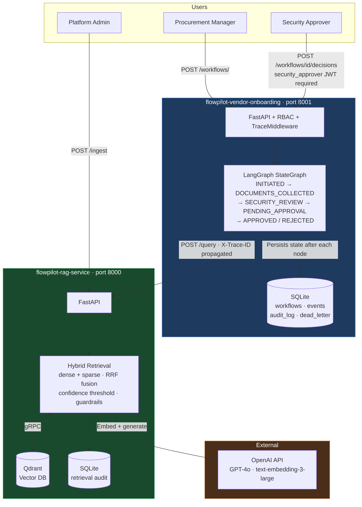

# flowpilot-docs

Architecture documentation for the FlowPilot AI Platform — a portfolio project demonstrating senior enterprise AI architect capabilities.

> **Audience:** Hiring managers and peer architects evaluating architectural depth. This repo is the architecture interview before the interview. Read the ADRs first.

---

## Architecture Overview

### Key architectural decisions at a glance

- **Two services, not one** — RAG service is domain-agnostic and reusable. Vendor onboarding calls it over REST. See [ADR-007](./adr/ADR-007-retrieval-separated-from-orchestration.md).
- **HITL is structural** — `security_approver` JWT required for decisions endpoint. Agent cannot self-approve. See [ADR-004](./adr/ADR-004-hitl-platform-concern.md).
- **Hybrid retrieval** — dense + sparse vectors fused via reciprocal rank fusion. Exact regulatory codes retrieved reliably. See [ADR-002](./adr/ADR-002-hybrid-retrieval.md).
- **Mock mode built in** — full workflow runs with `FP_MOCK_MODE=true`, zero API key, zero cost. See [ADR-009](./adr/ADR-009-mock-mode.md).

---

## Contents

| Section | What it covers |
|---------|---------------|
| [Architecture](./architecture/) | C4 diagrams (Context, Container, Component), sequence diagrams (happy path, 2 failure paths, approval timeout), domain boundaries |
| [ADRs](./adr/) | 11 Architecture Decision Records with genuine tradeoffs |
| [Governance](./governance/) | AI action boundaries, HITL enforcement, auditability model |
| [Demo Script](./demo/) | Step-by-step walkthrough of all three iterations |

---

## Repositories

| Repository | Purpose | Status |
|-----------|---------|--------|
| `flowpilot-rag-service` | Document ingestion, hybrid retrieval, grounding, guardrails | ✅ v0.1-mvp, v0.3-iteration-2 |
| `flowpilot-vendor-onboarding` | LangGraph orchestration, HITL approval, workflow state | ✅ v0.2-iteration-1, v0.3-iteration-2 |
| `flowpilot-docs` | This repo — architecture, ADRs, governance | ✅ Active |
| `flowpilot-platform` | Reusable platform layer — RBAC, audit, HITL interfaces | 🔄 In progress |
| `flowpilot-infra` | Terraform, Kubernetes, GitHub Actions CI/CD | 🔄 In progress |
| `flowpilot-ui` | React operational dashboard | 🔄 In progress |

---

## Release History

| Release | What it demonstrates |
|---------|---------------------|
| `v1.0-final` | Complete platform, live OpenAI, E2E tests, full documentation |
| `v0.3-iteration-2` | Operational resilience, retry, dead-letter, degraded mode, guardrails |
| `v0.2-iteration-1` | LangGraph agentic workflow, HITL approval gate, cross-service tracing |
| `v0.1-mvp` | RAG service, observability foundation, audit log, 58 unit tests |

---

## Start here

If you have **10 minutes**: read [ADR-007](./adr/ADR-007-retrieval-separated-from-orchestration.md) (why two services) and [ADR-004](./adr/ADR-004-hitl-platform-concern.md) (why HITL is a platform concern). These two decisions explain the entire architecture.

If you have **30 minutes**: read all ADRs, then [c4-container](./architecture/c4-container.md) and [sequence-happy-path](./architecture/sequence-happy-path.md).

If you want to **run it**: see [demo-script](./demo/demo-script.md).

---

*FlowPilot · NSCS B.V. · May 2026*
