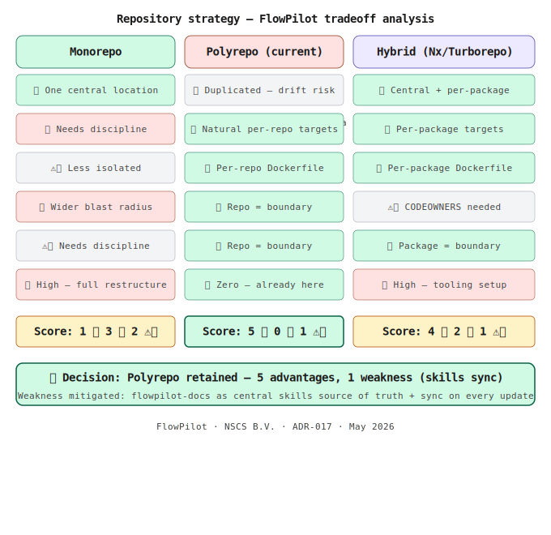

# ADR-017 — Repository Strategy: Polyrepo over Monorepo

**Status:** Accepted — May 2026

**Layer:** 🟠 Shared — all services

**Author:** Nitindra Soekhai, NSCS B.V.
**Relates to:** ADR-006 (FastAPI over Spring Boot), ADR-007 (Retrieval separated from orchestration), ADR-016 (Azure Key Vault)

---

## Context

FlowPilot consists of five repositories: `flowpilot-rag-service`, `flowpilot-vendor-onboarding`, `flowpilot-ui`, `flowpilot-infra`, and `flowpilot-docs`. As the platform evolved to include governed AI specialist collaboration (13 specialist contexts, dedicated delivery flow skill, per-agent briefs), a structural question emerged: should these repos be consolidated into a monorepo or remain separate?

The decision is consequential because:
- Skills and configuration (`.claude/skills/`, `CLAUDE.md`) must be consistent across all repos
- The delivery flow mandates clear agent boundaries — one agent per repo per brief
- Future deployment targets may include multi-cloud (Azure + AWS) and multi-infrastructure
- Each service runs in its own container with independent deployment pipelines

Three options were evaluated: monorepo, polyrepo (current), and hybrid monorepo (Nx/Turborepo).

---

## Decision

**Retain the polyrepo strategy. `flowpilot-docs` is the central source of truth for all shared skills and governance artefacts. A sync mechanism propagates changes to all repos.**

---

## Alternatives Considered

**Monorepo**
One Git repository containing all five services. Eliminates skills drift and simplifies CLAUDE.md governance. Rejected because it weakens the security boundary between services (one repo compromise = all services exposed), complicates multi-cloud deployment (all services must share one deployment pipeline unless carefully structured), and removes the natural agent boundary that the repo boundary currently provides. Migration cost is also significant — all Docker paths, CI/CD pipelines, and import references must be updated.

**Hybrid monorepo (Nx / Turborepo)**
One Git repository with per-package deployment targets and affected-only CI/CD pipelines. Provides the best of both worlds: central skills with independent deployment. Rejected because it introduces substantial tooling complexity (Nx/Turborepo configuration, affected-graph computation, package.json workspaces or equivalent) for a benefit that can be achieved more simply in the current polyrepo by centralising skills in `flowpilot-docs`. Migration cost equals the full monorepo option.

---

## Tradeoff Summary

| Dimension | Monorepo | Polyrepo | Hybrid |
|---|---|---|---|
| Skills & config | ✅ Central | ❌ Drift risk | ✅ Central |
| CI/CD | ⚠️ One pipeline | ❌ 5 pipelines | ✅ Affected-only |
| Multi-cloud / multi-infra | ❌ Needs discipline | ✅ Natural per-repo | ✅ Per-package targets |
| Multi-container | ⚠️ Less isolated | ✅ Per-repo Dockerfile | ✅ Per-package Dockerfile |
| Security boundaries | ❌ Wider blast radius | ✅ Repo = boundary | ⚠️ CODEOWNERS |
| Agent boundaries | ⚠️ Needs discipline | ✅ Repo = boundary | ✅ Package = boundary |
| Migration cost | ❌ High | ✅ Zero | ❌ High |

**Polyrepo score: 5 advantages, 1 weakness (skills sync). Weakness is addressed by this ADR.**

---

## Accepted Tradeoff

The one accepted downside of polyrepo is skills and configuration drift — if `.claude/skills/delivery-flow.md` changes in `flowpilot-docs`, the other four repos must be updated manually. This is mitigated by:

1. `flowpilot-docs/.claude/skills/` is the **single source of truth** for all shared skills
2. Each repo's `CLAUDE.md` explicitly references `flowpilot-docs` as the authoritative skills source
3. Any skills update triggers a sync commit to all repos before the change is considered complete
4. The `delivery-flow.md` skill mandates this sync as part of the CI/CD gate

The risk of drift is accepted as a known, managed operational overhead — preferable to the migration cost and tooling complexity of monorepo or hybrid approaches, and preferable to the governance weaknesses those approaches introduce for multi-cloud, multi-container, and security boundary requirements.

---

## Consequences

**Positive:**
- Zero migration cost — existing structure is preserved
- Each service retains an independent deployment pipeline, Dockerfile, and cloud target
- Multi-cloud deployments (Azure + AWS) remain structurally clean — no cross-service coupling
- Repo boundary = natural security boundary = natural agent boundary (one brief per agent per repo)
- `flowpilot-docs` gains a governance role as the platform's canonical skills and artefacts hub

**Negative:**
- Skills updates require a sync commit to all five repos — operational discipline required
- `CLAUDE.md` in each repo must explicitly reference `flowpilot-docs` as the skills source
- Risk of drift if sync is skipped — mitigated by delivery flow skill enforcement

---

*FlowPilot · NSCS B.V. · ADR-017 · May 2026*
