# C4 — Component Level

> Shows the internal components of `flowpilot-vendor-onboarding`. The RAG service component breakdown is in a separate diagram.

```mermaid
C4Component
    title flowpilot-vendor-onboarding — Component Diagram

    Person(procurement, "Procurement Manager")
    Person(approver, "Security Approver")

    System_Ext(rag_service, "flowpilot-rag-service", "Policy retrieval API")

    Container_Boundary(vo, "flowpilot-vendor-onboarding") {

        Component(trace_mw, "Trace Middleware", "Starlette BaseHTTPMiddleware", "Generates X-Trace-ID per request. Propagates upstream. Attaches to request.state.")
        Component(rbac, "RBAC Dependency", "FastAPI Depends()", "Decodes JWT HS256. Validates role → permission mapping. Writes audit row on every access attempt.")
        Component(router, "Workflows Router", "FastAPI APIRouter", "5 endpoints: create, read, decide, policy, events. Orchestrates graph invocation and finalize calls.")

        Component(graph, "LangGraph StateGraph", "LangGraph 0.2.x", "Compiled state machine: initiate → collect_documents → security_review → pending_approval → END")
        Component(initiate, "initiate_node", "Async node", "Retrieves policy via RAG client. Persists initial workflow record.")
        Component(collect, "collect_documents_node", "Async node", "Validates submitted documents vs required list. Flags missing — does not block.")
        Component(security, "security_review_node", "Async node", "Mock security assessment. Adds elevated-access finding for production requests.")
        Component(approval, "pending_approval_node", "Async node", "HITL gate. Saves PENDING_APPROVAL to SQLite. Graph ends here.")
        Component(finalize, "finalize_node", "Async function", "Called directly by router on HITL decision. Sets APPROVED or REJECTED.")

        Component(rag_client, "RAG Client", "httpx AsyncClient", "Calls RAG service with trace ID header. Mock mode returns deterministic policy text. DegradedModeError on 503/timeout.")
        Component(retry, "Retry Decorator", "app/utils/retry.py", "Exponential backoff, jitter, max 3 attempts. Logs every retry attempt.")
        Component(workflow_store, "Workflow Store", "aiosqlite", "CRUD for workflows, events, audit_log, dead_letter. Connection-per-operation pattern.")

        Component(sqlite, "SQLite", "workflows.db", "Four tables: workflows, workflow_events, audit_log, dead_letter")
    }

    Rel(procurement, trace_mw, "All requests", "HTTPS")
    Rel(approver, trace_mw, "All requests", "HTTPS")
    Rel(trace_mw, rbac, "Passes request with trace_id")
    Rel(rbac, router, "Passes authenticated user dict")
    Rel(router, graph, "graph.astream(initial_state)")
    Rel(router, finalize, "Direct call on POST /decisions")
    Rel(graph, initiate, "Node 1")
    Rel(graph, collect, "Node 2")
    Rel(graph, security, "Node 3")
    Rel(graph, approval, "Node 4 — graph ends")
    Rel(initiate, rag_client, "query_policy()")
    Rel(security, rag_client, "query_policy()")
    Rel(rag_client, retry, "Wrapped with @with_retry")
    Rel(rag_client, rag_service, "POST /query — X-Trace-ID propagated", "HTTP")
    Rel(initiate, workflow_store, "create_workflow()")
    Rel(collect, workflow_store, "update_workflow() + add_event()")
    Rel(security, workflow_store, "update_workflow() + add_event()")
    Rel(approval, workflow_store, "update_workflow(PENDING_APPROVAL)")
    Rel(finalize, workflow_store, "update_workflow(APPROVED/REJECTED)")
    Rel(workflow_store, sqlite, "aiosqlite.connect()")
```

---

## Key component decisions

**Why is RBAC a dependency, not middleware?**
FastAPI middleware does not have access to path parameters or the dependency graph. A middleware-based RBAC implementation would require manual path parsing. The dependency approach gives per-endpoint permission granularity with zero parsing logic.

**Why does the graph end at `pending_approval_node`?**
The original design used LangGraph's `interrupt()` / `Command(resume=...)` pattern for HITL. This created a version compatibility dependency — `Command` moved between LangGraph minor versions. The current design is more robust: the graph defines the pre-approval pipeline and ends; `finalize_node` is called directly by the router. HITL enforcement is structural through RBAC (only `security_approver` reaches the decisions endpoint) and a state guard (only `PENDING_APPROVAL` workflows can be decided).

**Why connection-per-operation in the workflow store?**
A shared async SQLite connection across concurrent FastAPI requests creates contention and state management complexity. Connection-per-operation via `aiosqlite.connect()` context managers is stateless and safe under asyncio. The overhead is negligible at portfolio scale.
