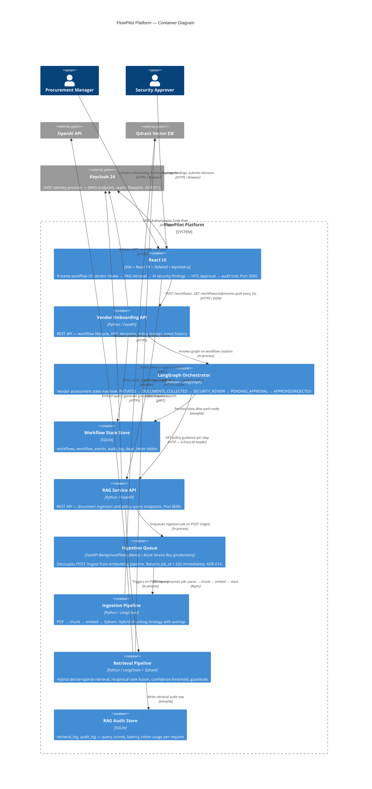

# C4 — Container Level

> Shows the internal structure of the FlowPilot platform: the services, their responsibilities, and how they communicate.

---

## Container responsibilities

### Vendor Onboarding API
Single FastAPI application. Handles auth (JWT RS256 via Keycloak JWKS, RBAC), trace ID generation, workflow CRUD, and HITL decision routing. Does not contain business logic — delegates to the LangGraph orchestrator.

### LangGraph Orchestrator
The vendor assessment state machine. Five nodes: `initiate` → `collect_documents` → `security_review` → `pending_approval` → `finalize`. Each node reads from and writes to the SQLite workflow store. The `pending_approval` node is the HITL gate — it saves state and returns; the graph resumes only when a security_approver calls the decisions endpoint.

### Workflow State Store
Three tables: `workflows` (canonical state), `workflow_events` (append-only audit trail per workflow), `audit_log` (all API-level auth and action events), `dead_letter` (failed steps after retry exhaustion). See [ADR-005](../adr/ADR-005-sqlite-workflow-state.md) for upgrade path to PostgreSQL.

### RAG Service API
Separate FastAPI application on port 8000. Domain-agnostic. Accepts `POST /ingest` (PDF → vector store) and `POST /query` (natural language → grounded response). Has no knowledge of vendor onboarding.

### Retrieval Pipeline
Hybrid dense + sparse retrieval fused via reciprocal rank fusion. Confidence threshold check before LLM call. Guardrails layer validates citation before returning response. See [ADR-002](../adr/ADR-002-hybrid-retrieval.md).

### RAG Audit Store
Every retrieval operation writes a row: query text, retrieval strategy, top-k scores, latency ms, confidence threshold met/failed, tokens in/out, model identifier, trace ID. Full AI decision chain is reconstructable from this log.
