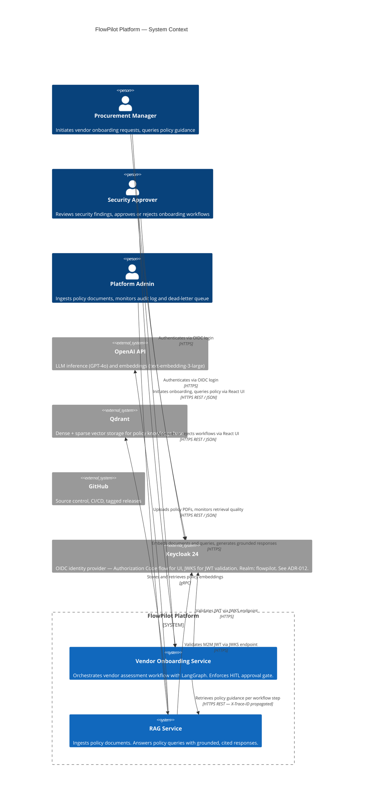

# C4 — Context Level

> Shows FlowPilot in context: who uses it, what external systems it depends on.

---

## Key context decisions

**React UI**
The React UI (Vite + React 18 + Tailwind, port 3000) is the user-facing client for both roles. It authenticates via Keycloak Authorization Code flow (keycloak-js). Session expiry triggers auto-redirect to Keycloak login. The UI is not shown as a separate internal System in this context diagram as it is a thin client — all business logic lives in the two internal services.

**Why two internal systems?**
The RAG service is domain-agnostic — it answers policy questions for any domain. The vendor onboarding service consumes it. Keeping them separate means a future HR onboarding or procurement domain can use the same RAG service without modification. See [ADR-007](../adr/ADR-007-retrieval-separated-from-orchestration.md).

**Why OpenAI?**
Single provider reduces integration surface for portfolio scope. The LLM abstraction layer allows swap to Azure OpenAI, Anthropic, or self-hosted without service-level changes. See [ADR-006](../adr/ADR-006-fastapi-over-spring-boot.md) for the technology rationale.

**Who cannot approve their own requests?**
The system enforces this structurally. The procurement_manager role can create workflows; the security_approver role can decide them. No JWT in the system carries both roles. The agent cannot call the decisions endpoint on its own behalf — it does not hold a security_approver token. See [ADR-004](../adr/ADR-004-hitl-platform-concern.md).
