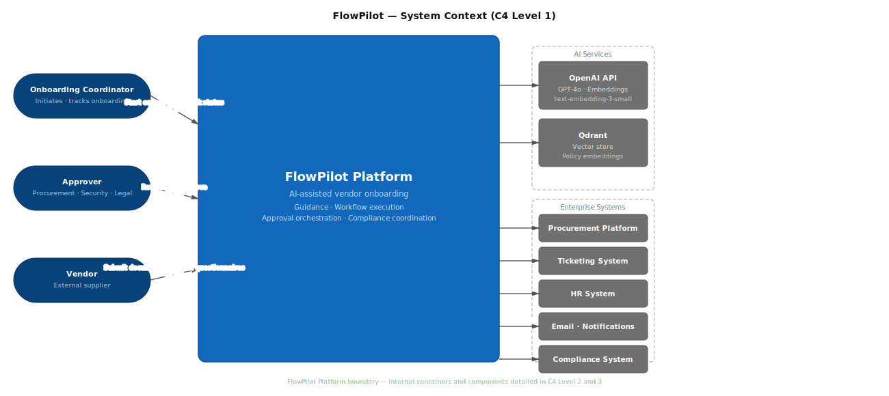

# C4 Level 1 — System Context

## Notes
- All interactions with external systems are mediated through FlowPilot Platform
- Internal containers (RAG service, vendor-onboarding, RBAC middleware) detailed in C4 Level 2
- OpenAI is called for both embeddings (rag-service) and completions (vendor-onboarding)
- Enterprise systems are accessed via IntegrationAdapter — see C4 Level 2
