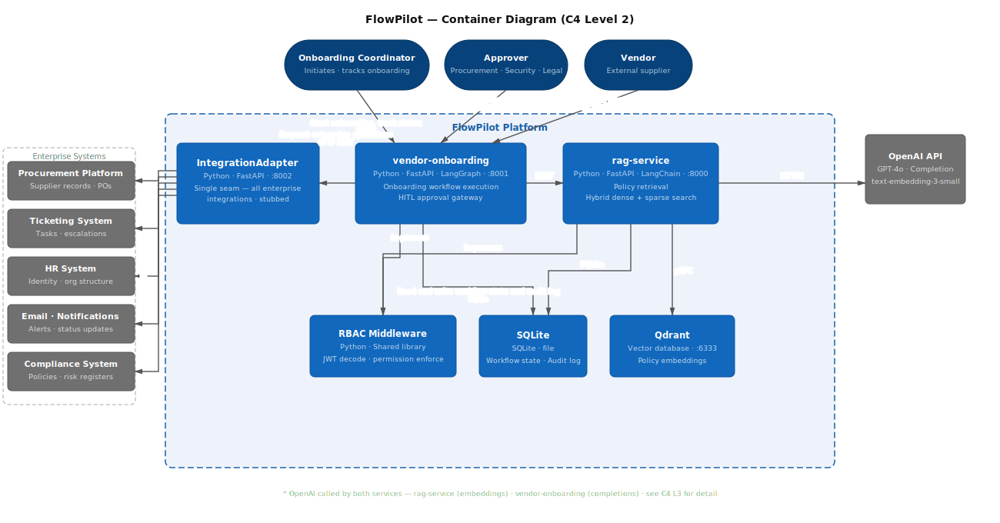

# C4 Level 2 — Container Diagram

## Design decision

`IntegrationAdapter` is the single seam between FlowPilot and all enterprise systems.
`flowpilot-vendor-onboarding` never calls enterprise systems directly — one container, one interface.

**Portfolio scope:** IntegrationAdapter is stubbed — returns mock responses per test persona.
**Production:** replace stub with real REST integrations behind the same interface.
