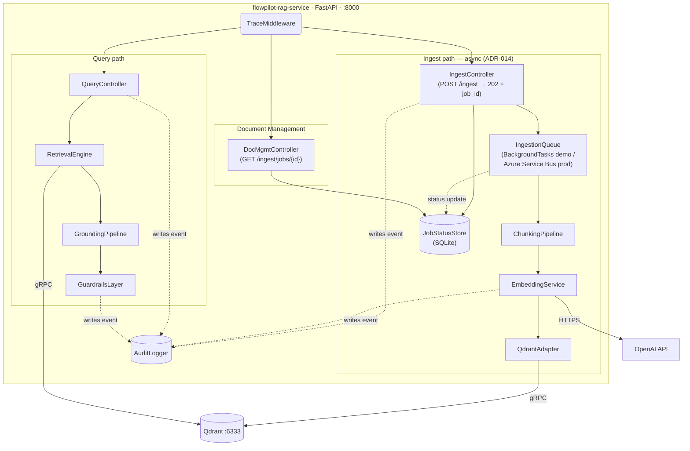

# C4 Level 3 — Component Model: flowpilot-rag-service

## Component responsibilities

| Component | Responsibility |
|---|---|
| TraceMiddleware | Injects trace ID; single entry point for both paths |
| IngestController | Accepts raw policy documents via POST /ingest — returns 202 + job_id immediately (ADR-014) |
| IngestionQueue | BackgroundTasks (demo) or Azure Service Bus (production) — decouples upload from embedding |
| JobStatusStore | SQLite table tracking ingestion job status: queued → processing → indexed → failed |
| DocMgmtController | GET /ingest/jobs/{id} — ingestion status for Document Management UI |
| ChunkingPipeline | Splits documents into retrievable chunks (LangChain splitter) |
| EmbeddingService | Generates dense (1536-dim) and sparse (BM25) embeddings |
| QdrantAdapter | Upserts embedding points to Qdrant collection |
| QueryController | Accepts retrieval queries via GET |
| RetrievalEngine | Hybrid dense + sparse search against Qdrant |
| GroundingPipeline | Formats retrieved chunks with source citations |
| GuardrailsLayer | Validates confidence threshold before returning response |
| AuditLogger | Cross-cutting — writes structured events from every component |
