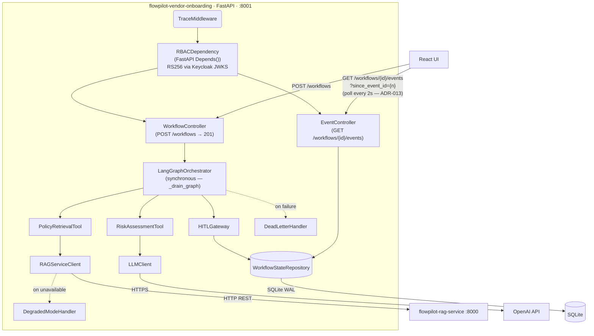

# C4 Level 3 — Component Model: flowpilot-vendor-onboarding

> **Option B — ADR-013:** LangGraph runs synchronously inside POST /workflows. All events are
> written to SQLite before 201 is returned. The UI polls GET /workflows/{id}/events every 2
> seconds after receiving 201, displaying events progressively. Polling stops when
> `current_state` reaches `pending_approval` or `complete`. The `since_event_id` query
> parameter (Track 4) allows the client to receive only new events on each poll.
>
> Option A (SSE + async LangGraph decoupling) is documented in ADR-013 as future work.

## Component responsibilities

| Component | Responsibility |
|---|---|
| TraceMiddleware | Injects trace ID; propagates user_context through graph |
| RBACDependency | FastAPI Depends() — decodes JWT RS256 via Keycloak JWKS; filters system roles; validates role → permission mapping; writes audit row |
| WorkflowController | Handles POST /workflows — validates input, runs graph synchronously, returns 201 |
| EventController | Handles GET /workflows/{id}/events — returns events ordered by id ASC; supports since_event_id filter |
| LangGraphOrchestrator | Stateful 4-node agent graph: collect → retrieve → assess → approve (synchronous via _drain_graph) |
| PolicyRetrievalTool | LangGraph tool node — calls RAGServiceClient |
| RAGServiceClient | HTTP client for flowpilot-rag-service; triggers DegradedModeHandler on failure |
| RiskAssessmentTool | LangGraph tool node — calls LLMClient for risk scoring |
| LLMClient | OpenAI GPT-4o client; constructs risk prompt with grounded policy chunks |
| HITLGateway | LangGraph tool node — routes to human approver; persists approval state |
| WorkflowStateRepository | SQLite-backed (WAL mode) state persistence for LangGraph checkpointing and event log |
| DeadLetterHandler | Captures failed agent runs for retry or manual triage |
| DegradedModeHandler | Fallback behaviour when RAG service is unavailable |
