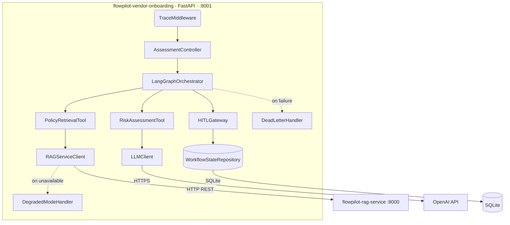

# C4 Level 3 — Component Model: flowpilot-vendor-onboarding

## Component responsibilities

| Component | Responsibility |
|---|---|
| TraceMiddleware | Injects trace ID; propagates user_context through graph |
| AssessmentController | Handles POST /assessments — validates input, initiates graph |
| LangGraphOrchestrator | Stateful 4-node agent graph: collect → retrieve → assess → approve |
| PolicyRetrievalTool | LangGraph tool node — calls RAGServiceClient |
| RAGServiceClient | HTTP client for flowpilot-rag-service; triggers DegradedModeHandler on failure |
| RiskAssessmentTool | LangGraph tool node — calls LLMClient for risk scoring |
| LLMClient | OpenAI GPT-4o client; constructs risk prompt with grounded policy chunks |
| HITLGateway | LangGraph tool node — routes to human approver; persists approval state |
| WorkflowStateRepository | SQLite-backed state persistence for LangGraph checkpointing |
| DeadLetterHandler | Captures failed agent runs for retry or manual triage |
| DegradedModeHandler | Fallback behaviour when RAG service is unavailable |
