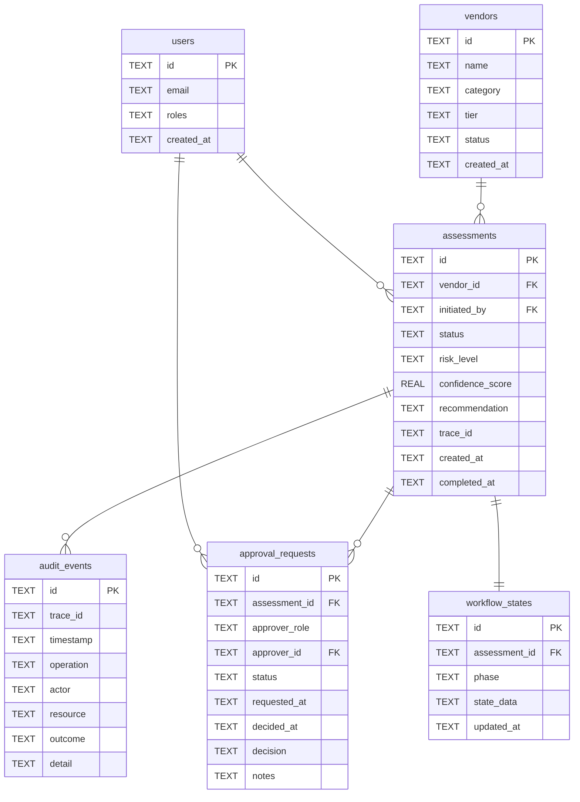

# Data Model — SQLite Physical Schema + Qdrant Collection Spec

## SQLite — physical schema

> **Note:** The schema above is the **conceptual domain model**. The implemented SQLite schema in `flowpilot-vendor-onboarding` uses: `workflows`, `workflow_events`, `audit_log`, `dead_letter`. These map to the conceptual entities but are optimised for the LangGraph state machine pattern rather than normalised relational design.

### Type notes

- All IDs are `TEXT` UUID v4 — SQLite has no native UUID type
- All timestamps are `TEXT` ISO-8601 — avoids SQLite datetime quirks
- `state_data` is a JSON blob — LangGraph checkpoints serialised here
- `detail` on audit_events is a nullable JSON blob for extended context
- `roles` on users is a JSON array — stubbed; e.g. `["procurement_manager"]`

### Enum values

| Column | Valid values |
|---|---|
| `vendors.tier` | `1`, `2`, `3` |
| `vendors.status` | `active`, `pending`, `rejected` |
| `assessments.status` | `pending`, `in_review`, `approved`, `rejected` |
| `assessments.risk_level` | `low`, `medium`, `high` |
| `approval_requests.status` | `pending`, `approved`, `rejected`, `expired` |
| `approval_requests.decision` | `approve`, `reject`, `defer` |
| `workflow_states.phase` | `collecting`, `retrieving`, `assessing`, `awaiting_approval`, `completed` |
| `audit_events.outcome` | `success`, `failure`, `blocked` |

---

## Qdrant — collection spec

**Collection name:** `policy_chunks`

### Vector config

| Field | Value |
|---|---|
| Dense vector size | 1536 dimensions |
| Distance metric | Cosine |
| Embedding model | `text-embedding-3-large` (OpenAI) |
| Sparse vector index | `sparse` |
| Sparse modifier | `idf` (BM25 scoring) |

### Payload schema

| Field | Type | Notes |
|---|---|---|
| `document_id` | keyword | FK reference to source document |
| `document_title` | keyword | e.g. "Security Policy v3.2" |
| `section` | keyword | e.g. "§4.1" |
| `chunk_index` | integer | Position within parent document |
| `text` | text | Full chunk text — full-text indexed |
| `ingested_at` | datetime | ISO-8601 |
| `confidence_floor` | float | Minimum retrieval score threshold |

### Retrieval strategy

Hybrid search: dense cosine similarity (semantic) + sparse BM25 (keyword) with reciprocal rank fusion. Top-k = 4 at query time. Confidence floor = 0.80.
