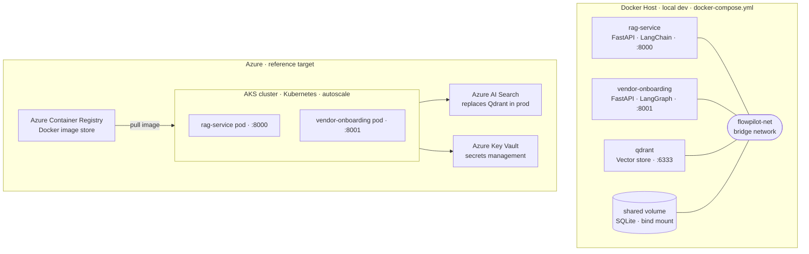

# Deployment Diagram — Docker Local + Azure Reference

## Environment comparison

| Concern | Docker local | Azure reference |
|---|---|---|
| Orchestration | docker-compose | AKS (Kubernetes) |
| Vector store | Qdrant container | Azure AI Search |
| Secrets | `.env` file | Azure Key Vault |
| Image registry | local build | Azure Container Registry |
| Scaling | single instance | pod autoscale |
| SQLite | bind mount volume | Azure Files or Postgres (TBD) |
