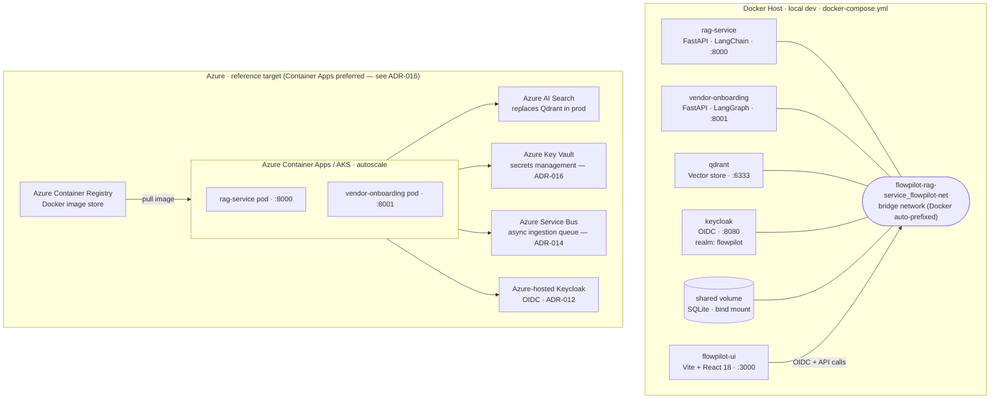

# Deployment Diagram — Docker Local + Azure Reference

## Environment comparison

| Concern | Docker local | Azure reference |
|---|---|---|
| Orchestration | docker-compose | Azure Container Apps (ADR-016) |
| Vector store | Qdrant container | Azure AI Search |
| Secrets | `.env` file | Azure Key Vault via Managed Identity (ADR-016) |
| Auth | Keycloak :8080 (Docker) | Azure-hosted Keycloak (ADR-012) |
| Image registry | local build | Azure Container Registry |
| Ingestion queue | FastAPI BackgroundTasks | Azure Service Bus (ADR-014) |
| Scaling | single instance | Container Apps autoscale |
| SQLite | bind mount volume | Azure Files or Postgres (TBD) |

## Azure Migration Prerequisites

### Keycloak issuer must be canonicalised before cutover

In local dev, Keycloak emits tokens with `iss` derived from the request host:
service-to-service calls inside the Docker network receive `iss=http://keycloak:8080/realms/flowpilot`, while UI-initiated flows through the host receive `iss=http://localhost:8080/realms/flowpilot`. Both vendor-onboarding and rag-service currently pin `KEYCLOAK_ISSUER=http://localhost:8080/realms/flowpilot` and rely on Keycloak's `KC_HOSTNAME` (set in `flowpilot-infra/keycloak/`) to force every token to emit the canonical issuer.

When moving to Azure, the following must be updated atomically — partial updates leave services unable to validate tokens:

| Component | Change |
|---|---|
| Keycloak (`KC_HOSTNAME` / realm `frontendUrl`) | Set to the public Azure Keycloak URL (e.g. `https://auth.flowpilot.example.com`) |
| `KEYCLOAK_ISSUER` in **vendor-onboarding** | Update to match the new frontend URL |
| `KEYCLOAK_ISSUER` in **rag-service** | Update to match the new frontend URL |
| `KEYCLOAK_TOKEN_URL` (vendor-onboarding) | Update to the new realm token endpoint |
| `KEYCLOAK_JWKS_URL` (both services) | Update to the new realm JWKS endpoint |

After cutover, invalidate any cached service-account tokens (restart the services or call `token_cache.invalidate_cache()`) — cached tokens still carry the old `iss` claim and will be rejected by the newly-configured validators.

See [ADR-016](../adr/ADR-016-secrets-management-azure-key-vault.md) for how these values flow from Azure Key Vault, and the I-09 secret rotation runbook for the cutover sequence.
