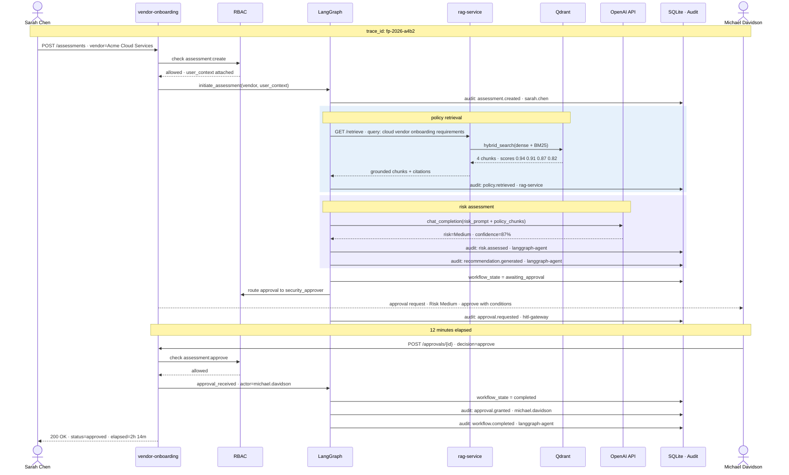

# Happy Path Sequence Diagram

Acme Cloud Services onboarding — trace_id: `fp-2026-a4b2`

## Audit trail (7 events)

| # | Operation | Actor | Outcome |
|---|---|---|---|
| 1 | `assessment.created` | sarah.chen | success |
| 2 | `policy.retrieved` | rag-service | success |
| 3 | `risk.assessed` | langgraph-agent | success |
| 4 | `recommendation.generated` | langgraph-agent | success |
| 5 | `approval.requested` | hitl-gateway | success |
| 6 | `approval.granted` | michael.davidson | success |
| 7 | `workflow.completed` | langgraph-agent | success |
