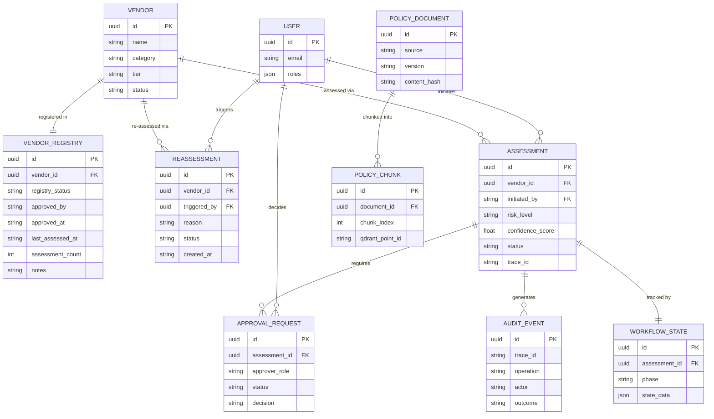

# Information Model — Domain Entities

## Notes

- `VENDOR_REGISTRY` tracks approved vendors post-onboarding — added in v1.2. Prevents duplicate onboarding of already-registered vendors.
- `REASSESSMENT` supports periodic re-evaluation of existing vendors — triggers a new assessment workflow without creating a new vendor record.

- `AUDIT_EVENT.trace_id` is the cross-cutting correlation key — every entity that participates in a workflow produces audit events tied to the same trace ID
- `WORKFLOW_STATE` is 1:1 with `ASSESSMENT` — one state machine per assessment run
- `POLICY_CHUNK.qdrant_point_id` is the foreign key into Qdrant — SQLite and Qdrant stay in sync via this field
- `USER.roles` is a JSON array — stubbed for portfolio; production replaces with IdP claims
