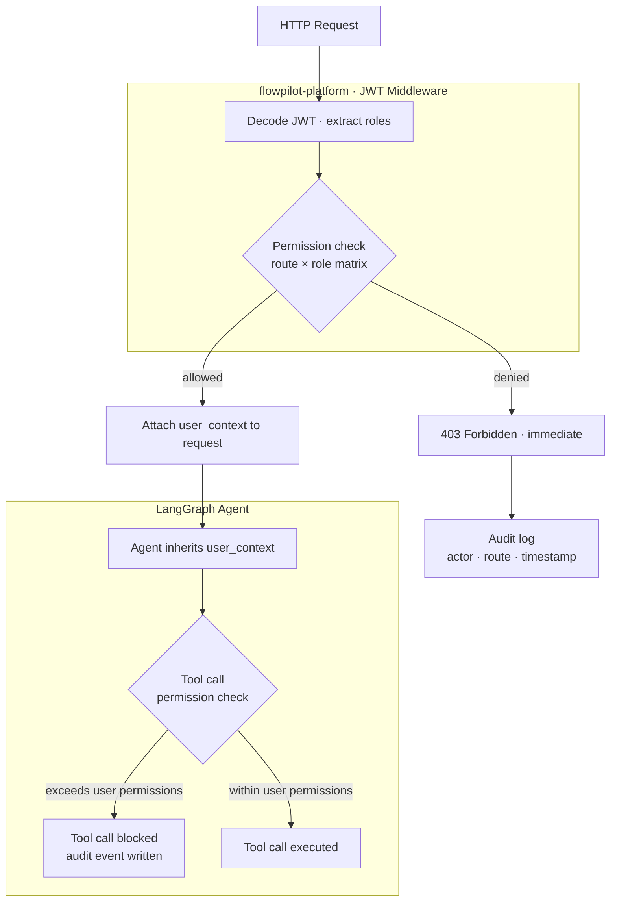

# RBAC — Role Matrix and Enforcement Architecture

## Role-permission matrix

| Role | assessment:create | assessment:read | assessment:approve | policy:upload | policy:read | audit:read | user:manage |
|---|:---:|:---:|:---:|:---:|:---:|:---:|:---:|
| `admin` | ✓ | ✓ | ✓ | ✓ | ✓ | ✓ | ✓ |
| `procurement_manager` | ✓ | ✓ | — | — | ✓ | — | — |
| `security_approver` | — | ✓ | ✓ | — | ✓ | — | — |
| `compliance_approver` | — | ✓ | ✓ | — | ✓ | — | — |
| `policy_manager` | — | ✓ | — | ✓ | ✓ | — | — |
| `viewer` | — | ✓ | — | — | ✓ | — | — |

## Resource-permission model

```
assessment:create     → procurement_manager, admin
assessment:read       → all authenticated roles
assessment:approve    → security_approver, compliance_approver, admin
policy:upload         → policy_manager, admin
policy:read           → all authenticated roles
workflow:manage       → admin
audit:read            → admin
user:manage           → admin
```

## Enforcement architecture



## Implementation scope

| Component | Built | Stubbed |
|---|:---:|:---:|
| JWT middleware — decode and permission check | ✓ | |
| Role matrix enforced on all routes | ✓ | |
| Agent permission inheritance via user_context | ✓ | |
| Audit log on every 403 | ✓ | |
| User management UI | | ✓ |
| Token issuance and login flow | | ✓ |

> Hardcoded JWTs per test persona for portfolio scope. Production integrates with Azure AD.
