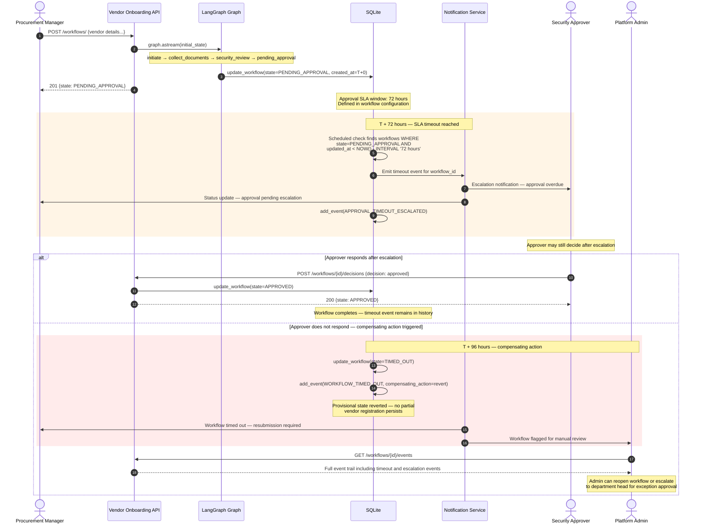

# Sequence Diagram — Approval Timeout

> What happens when a security_approver does not respond within the SLA window. The workflow cannot be left in PENDING_APPROVAL indefinitely — stakeholders must be notified and the state must be recoverable without data loss.



---

## Timeout configuration

| SLA boundary | Duration | Action |
|-------------|----------|--------|
| Approval SLA | 72 hours | Escalation notification to approver and requester |
| Compensating action | 96 hours | Workflow state → TIMED_OUT, provisional state reverted |
| Manual review flag | On TIMED_OUT | Platform admin notified, workflow visible in review queue |

Timeout thresholds are defined in workflow configuration — not hardcoded. Different vendor types or access levels can carry different SLA windows (e.g. emergency onboarding: 4 hours; standard: 72 hours).

---

## What the audit log contains after a timeout

```sql
-- Events for a timed-out workflow
SELECT event_type, actor, timestamp, payload
FROM workflow_events
WHERE workflow_id = '<id>'
ORDER BY id;

-- Returns:
-- WORKFLOW_INITIATED        | sarah.chen       | T+0
-- DOCUMENTS_COLLECTED       | sarah.chen       | T+0
-- SECURITY_REVIEW_COMPLETED | system           | T+0
-- ROUTED_FOR_APPROVAL       | system           | T+0
-- APPROVAL_TIMEOUT_ESCALATED| system           | T+72h
-- WORKFLOW_TIMED_OUT        | system           | T+96h
```

A compliance auditor can reconstruct the full timeline: who submitted, when it was routed, when the SLA was breached, and what compensating action was taken.

---

## Production implementation note

The portfolio implementation (Days 1-3) does not include a background SLA scheduler. In production this would be implemented via:

- **Temporal activities with deadlines** — the approval step is a Temporal activity with a configurable deadline. On timeout, Temporal automatically routes to the compensating workflow.
- **Alternatively:** A scheduled job (cron or Celery Beat) that queries PENDING_APPROVAL workflows older than the SLA window and emits timeout events.

This is a documented gap (see [governance model](../governance/governance-model.md)) — not a hidden limitation.
