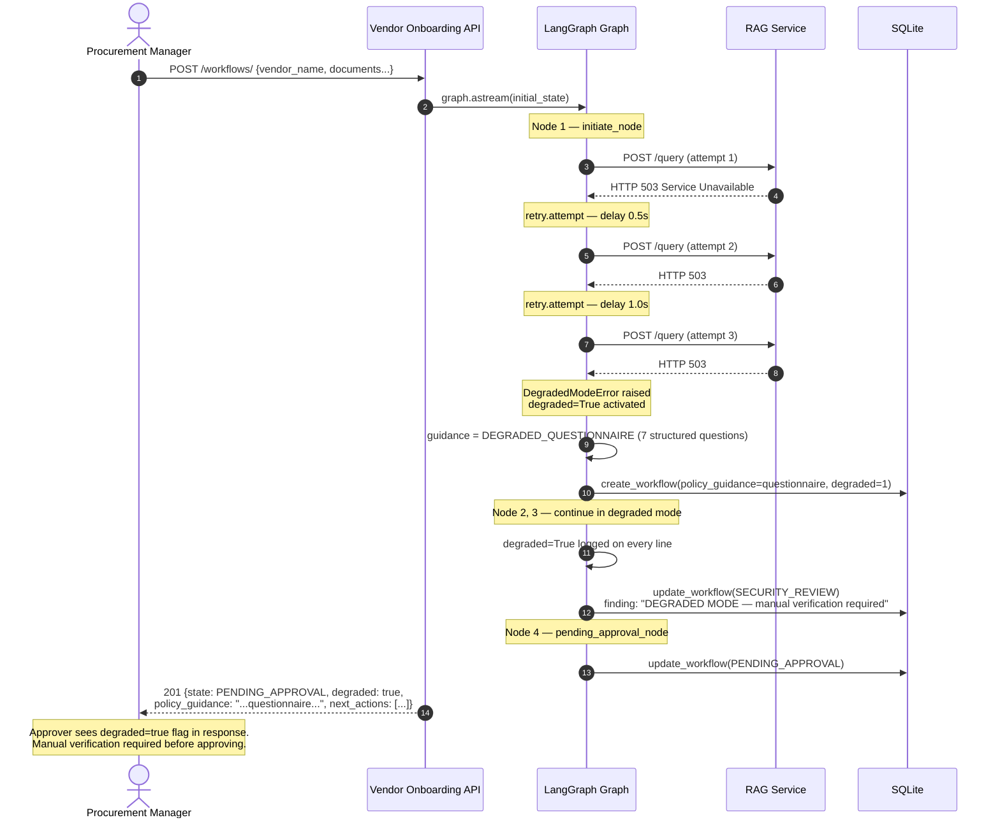
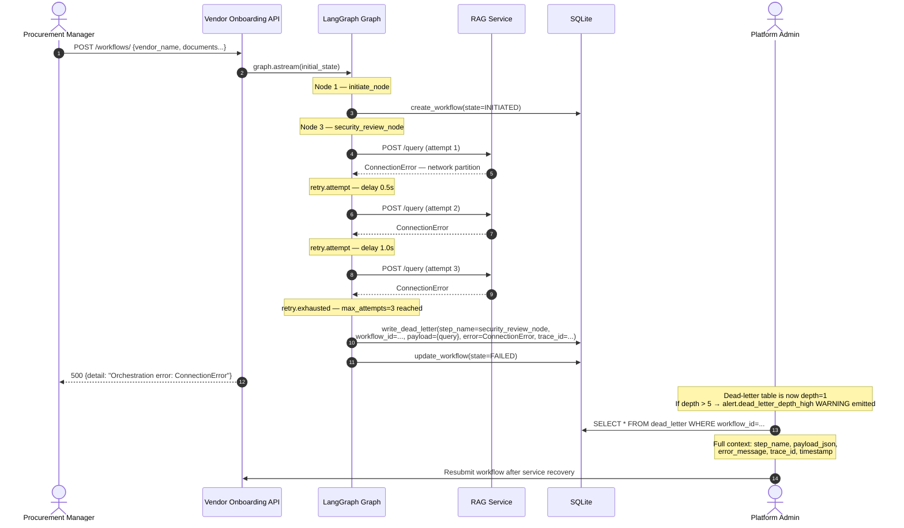

# Sequence Diagrams — Failure Paths

Two failure scenarios: RAG service unavailable (degraded mode) and retry exhaustion leading to dead-letter.

---

## Failure Path 1 — RAG Service Unavailable (Degraded Mode)

> When the RAG service returns 503 or times out, the workflow activates degraded mode: a structured questionnaire replaces AI guidance. Every log line carries `degraded=true`. The workflow still completes to PENDING_APPROVAL — no autonomous decisions are made in degraded mode.

**What the approver sees:** The workflow response includes `"degraded": true`. The security findings include an explicit finding: *"DEGRADED MODE: Security review based on questionnaire — manual verification required when RAG service is restored."* The approver is expected to manually verify before approving.

**What is logged:** Every structlog line from initiate_node onward carries `degraded=True`. The three retry attempts are logged with attempt number, delay, and error reason. The DegradedModeError activation is a WARNING log line.

---

## Failure Path 2 — Retry Exhaustion → Dead Letter

> When a non-503 failure exhausts all retry attempts (e.g. network partition, unexpected error), the step is dead-lettered and the workflow is set to FAILED. No silent data loss.

**Dead-letter record contains:**
- `service` — flowpilot-vendor-onboarding
- `step_name` — security_review_node
- `workflow_id` — UUID of the failed workflow
- `payload_json` — the RAG query that failed
- `error_message` — full exception string
- `trace_id` — links to all log lines from that request
- `timestamp` — when the failure was recorded

**Alerting:** When `dead_letter` depth exceeds 5, `alert.dead_letter_depth_high` WARNING is emitted by `app/utils/alerting.py`. This is consumed by log aggregator alert rules (Grafana/ELK) — no metrics server required.
