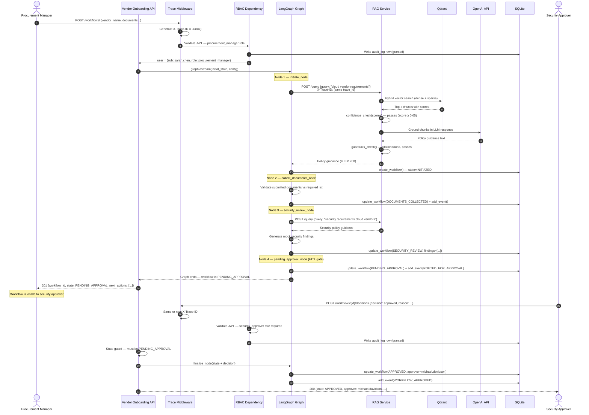

# Sequence Diagram — Happy Path

> Full vendor onboarding workflow from request submission to approval. Every step observable via trace ID.

---

## Observable artefacts at each step

| Step | What is logged | Where |
|------|---------------|-------|
| Request arrival | `trace_id`, `user`, `role`, `path` | structlog stdout |
| RBAC check | `permission`, `outcome`, `role` | audit_log table |
| RAG retrieval | `query`, `top_score`, `latency_ms`, `confidence_passed` | rag audit_log |
| LLM call | `tokens_in`, `tokens_out`, `model`, `latency_ms` | rag audit_log |
| Guardrails | `matched_pattern`, `blocked` | structlog stdout |
| Node transition | `node`, `current_state`, `trace_id` | structlog stdout |
| Workflow state change | `workflow_id`, `state`, `updated_at` | workflows table |
| Approval decision | `approver`, `decision`, `reason` | workflow_events |

**Full audit trail reconstruction:** given any `workflow_id`, join `workflows` + `workflow_events` + `audit_log` on `trace_id` to reconstruct the complete AI decision chain — what was retrieved, what the LLM said, what the human decided, in chronological order.
